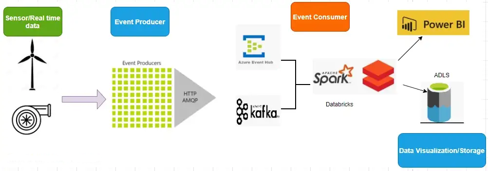

# Databricks Structured streaming using EventHub, Kafka & PowerBI

The use case for this scenario is to capture real time streaming data from sensors and IoT devices and then process it for data analysis and visualization purposes.

    Databricks Streaming using Event hub

> *The above architecture is a prototype of industrial cloud automation using sensor data.*

---

### **Use Case:**

Consider a wind farm, where hundreds of wind turbines are harnessing energy from wind and storing them as energy in large cells. All these big equipments are located in remote offshore and often requires engineers to travel long distance to troubleshoot them.

Leveraging IoT, Machine level data processing and streaming can save a lot to the industry.

Follow this [article ](https://sanajitghosh.medium.com/databricks-structured-streaming-using-eventhub-kafka-powerbi-ebbab7a6c7ed)for implementaion
